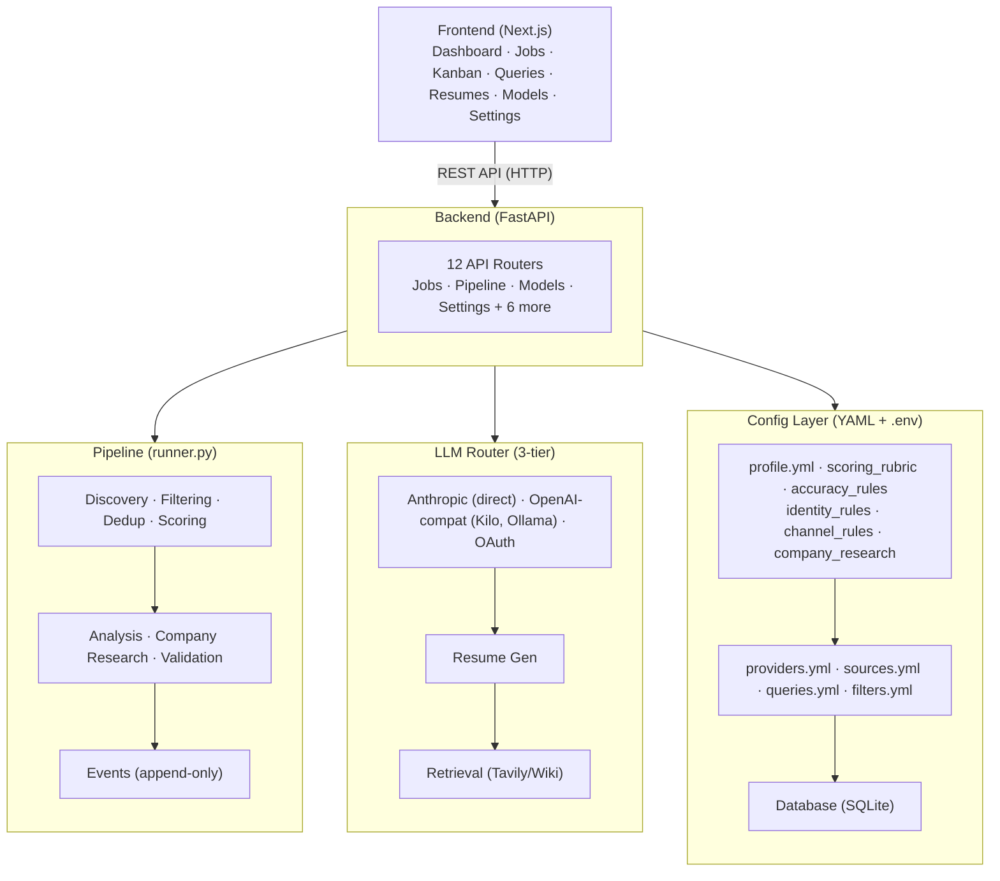
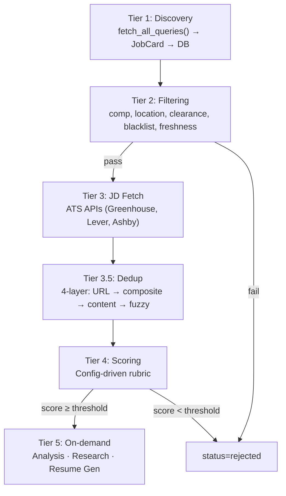
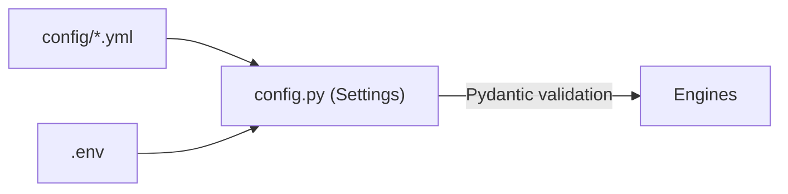
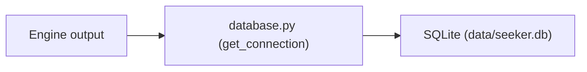
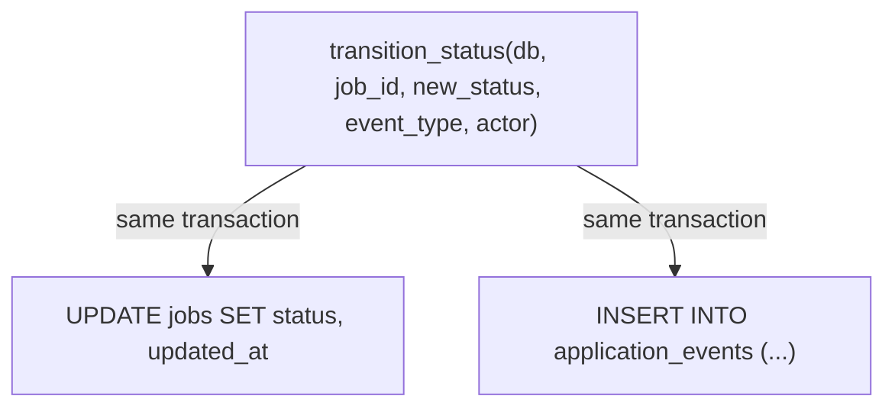
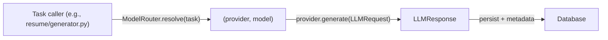
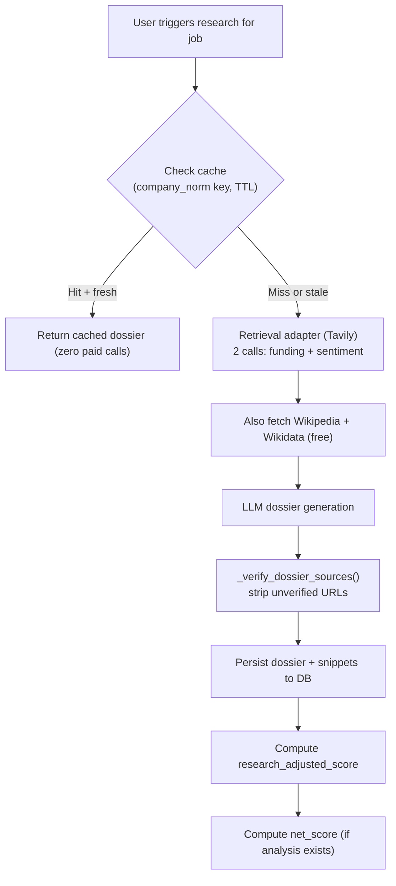

# Seeker OS — System Architecture

**Purpose:** Comprehensive architectural overview of Seeker OS. Read this to understand the full system — module boundaries, data flow, and how the pieces connect.

---

## High-Level Architecture



---

## Backend Module Map

```
backend/seeker_os/
├── api/                    FastAPI routers (12 routers, 1 schema file)
│   ├── app.py              Main app — CORS, logging, router registration, /health, /logs
│   ├── jobs.py             Job CRUD, status transitions, analysis, research, resume gen, bulk actions, recruiter contact CRUD
│   ├── pipeline.py         Pipeline run (sync + SSE streaming), run history
│   ├── queries.py          Search query CRUD + run
│   ├── analytics.py        Funnel stats, response rate stats
│   ├── resumes.py          Resume list, generate, generate-stream, download, delete, revalidate
│   ├── models.py           LLM provider/model config, fetch, test, OAuth flow
│   ├── profile_routes.py   Profile, filters, accuracy rules CRUD + AI-generate rules
│   ├── company_research.py Run + get company research per job
│   ├── company_research_settings.py  Retrieval settings (Tavily config)
│   ├── jd_analysis.py      Run + get JD analysis per job
│   ├── settings_routes.py  Generic settings key-value store
│   ├── backup.py           Download/restore config zip + SQLite DB
│   └── schemas.py          Pydantic request/response models for all routers
├── analysis/
│   ├── jd_analyzer.py      LLM-powered JD analysis (verdict, gaps, rubric breakdown)
│   └── metadata_extractor.py  LLM-powered metadata extraction from JD text
├── config.py               YAML config loading, env var resolution, Pydantic validation
├── config_writer.py        Write config updates back to YAML files
├── crossref/
│   └── jobsearch_repo.py   Cross-reference repo scanner (git pull, read-only)
├── database.py             SQLite connection, schema migrations (versioned via PRAGMA user_version), recruiter_contacts table
├── dedup/
│   ├── layers.py           4-layer dedup: URL hash → composite key → content hash → fuzzy
│   └── normalize.py        Canonical company normalizer (single source of truth)
├── discovery/
│   ├── engine.py           Iterates sources × queries, dedupes across queries
│   ├── cache.py            Disk cache for HTTP responses
│   ├── ats_fetch.py        Fetch full JD from ATS (Greenhouse, Lever, etc.)
│   └── sources/
│       ├── base.py         SourceAdapter protocol + JobCard model
│       ├── registry.py     Build adapters from sources.yml
│       └── hiring_cafe.py  hiring.cafe adapter (httpx + __NEXT_DATA__ extraction)
├── env_utils.py            .env file read/write helpers
├── events.py               Append-only event log, status transitions, stale tracking
├── filtering/
│   ├── hard_filters.py     Tier 2 hard reject filters (comp, location, clearance, etc.)
│   └── title_patterns.py   Title pattern matching
├── llm/
│   ├── base.py             LLMProvider protocol, LLMRequest/LLMResponse models
│   ├── router.py           ModelRouter — task → tier → provider + model resolution
│   ├── anthropic_provider.py    Native Anthropic Messages API provider
│   ├── anthropic_oauth.py  OAuth PKCE flow for Anthropic
│   ├── openai_compat_provider.py  OpenAI-compatible provider (Kilo, Ollama, etc.)
│   ├── models.py           ModelInfo, TierMapping, TaskMapping, TruncationError
│   └── cache.py            Model list disk cache (24h TTL)
├── models.py               Pydantic data models (JobCard, SourceQuery, SourcePage)
├── pipeline/
│   └── runner.py           Pipeline orchestrator — ties discovery → filter → dedup → score → events
├── research/
│   ├── company_research.py Company research engine (retrieval → LLM dossier → URL verification)
│   ├── models.py           Research data models (Dossier, FundingData, SentimentData)
│   ├── prompts/            Dossier generation system prompt
│   └── retrieval/
│       ├── base.py         RetrievalAdapter protocol
│       ├── models.py       RetrievalResult, RetrievalSnippet
│       ├── registry.py     Build adapter from company_research.yml
│       └── tavily.py       Tavily retrieval adapter
├── resume/
│   ├── generator.py        Resume generation (LLM + identity rules + channel rules)
│   ├── export.py           Export to PDF, DOCX, Markdown
│   ├── extract.py          Extract text from uploaded resume file
│   ├── validator.py        Backward-compat shim → seeker_os/validation/
│   └── prompts/            Resume generation system + user prompt templates
├── scoring/
│   ├── engine.py           Scoring engine (evidence gate → hard reject → base → modifiers → clamp)
│   ├── net_score.py        Net score composite (base + research + verdict cap)
│   └── research_adjustment.py  Research-adjusted score (deterministic modifiers)
└── validation/
    ├── __init__.py         Artifact-agnostic validator (deny-list, required phrases, etc.)
    ├── traceability.py     LLM-judged claim traceability against master resume
    └── prompts/            Traceability judgment prompt
```

---

## Pipeline Flow

The pipeline (`pipeline/runner.py`) is the core orchestration. It runs in tiers:



Pipeline runs are triggered on-demand via the API (`POST /api/pipeline/run` or
`POST /api/pipeline/run/stream` for SSE progress). No cron — on-demand first.

---

## Data Flow

### Config → Engine



All engines receive a `Settings` object. They never read YAML directly at runtime.
The `Settings` class loads all YAML files, resolves `${VAR}` references against
`os.environ`, expands paths, and validates via Pydantic v2 models.

### Engine → Database



All writes go through `get_connection()` which returns a `sqlite3.Connection` with
`row_factory = Row` (dict-like access) and `PRAGMA foreign_keys = ON`.

### Status Changes → Events



Every status change goes through `transition_status()` in `events.py`. This guarantees
the append-only event log gets a row. Direct `UPDATE jobs SET status` without an event
is a bug.

### LLM Call Flow



The router checks per-task overrides first, then falls back to tier defaults, then to
fallback provider/model. See `docs/LLM_ROUTING.md` for full details.

### Company Research Flow



---

## Config Layer

All user-specific configuration lives in YAML files under `config/`. Real configs are
gitignored; `*.example.yml` templates ship with placeholder values.

| Config File | Purpose | Pydantic Model |
|---|---|---|
| `profile.yml` | User profile: target role, location, comp, experience, blacklist | `ProfileConfig` |
| `scoring_rubric.yml` | Scoring rubric: base scores, modifiers, thresholds, verdict caps | `ScoringRubricConfig` |
| `accuracy_rules.yml` | Resume validation: disallowed phrases, forbidden tech, required phrases | `AccuracyRulesConfig` |
| `identity_rules.yml` | Positioning, experience anchor, honest qualifiers, never-claim list | `IdentityRulesConfig` |
| `channel_rules.yml` | Per-output-type constraints (resume, cover letter, application answer) | `ChannelRulesConfig` |
| `providers.yml` | LLM providers, models, tier mappings, task overrides | `LLMConfig` |
| `sources.yml` | Source adapter config (hiring.cafe URL, request delay, source map) | `SourcesConfig` |
| `queries.yml` | Search queries (source_id, slug, label, max_pages, enabled) | `QueriesConfig` |
| `filters.yml` | Tier 2 filter config (comp floor, location, freshness, etc.) | `FiltersConfig` |
| `company_research.yml` | Retrieval provider, query templates, thresholds, TTL | `CompanyResearchConfig` |

### Config Loading

1. `.env` loaded via `python-dotenv` at startup
2. YAML files parsed
3. `${VAR_NAME}` references resolved against `os.environ`
4. Path values expanded (`~` → home, relative → project root)
5. Pydantic v2 models validate the final merged config
6. Validation errors are fatal; unresolved env vars warn (feature disabled)
7. Literal-looking secrets in credential fields warn

### Config Updates from UI

The Settings UI writes config updates through `config_writer.py`, which:
- Reads the current YAML
- Updates the specific fields
- Writes back to the YAML file
- For secrets: writes the literal to `.env`, writes only `${VAR}` reference to YAML
- Calls `os.environ.update(...)` so changes take effect without restart
- Invalidates the in-memory config cache

---

## Database

SQLite at `data/seeker.db`. Single-user, zero-config. No Alembic — simple versioned
migrations via `PRAGMA user_version`. Current schema version: 29 (see `database.py` `MIGRATIONS` list).

**Notable migrations:**
- v25: `recruiters` + `recruiter_job_contacts` tables (replaces flat columns on jobs)
- v26: `ON DELETE CASCADE` added to all child tables referencing `jobs(id)`
- v27: `company_research` refactored — dropped `job_id` FK, added `triggered_by_job_id` (metadata only), non-unique index on `company_norm`, dedup stale rows
- v28: Dropped unused `cover_letters` + `application_answers` tables (see #85 for future unified `generated_documents` table)

### Key Tables

| Table | Purpose |
|---|---|
| `jobs` | Core job records (title, company, score, status, etc.) |
| `application_events` | Append-only event log (status changes, lifecycle events) |
| `recruiter_contacts` | Recruiter contacts per job (name, email, phone, linkedin, agency, source, contacted_at, notes) — supports multiple recruiters per job |
| `job_analyses` | LLM JD analysis results (verdict, gaps, rubric breakdown) |
| `company_research` | Company research dossiers + retrieval snippets |
| `resumes` | Generated resumes (text, validation, metadata) |
| `pipeline_runs` | Pipeline run history |

---

## Frontend

Next.js (App Router) + Tailwind CSS + shadcn/ui. All pages are client-side rendered
with data fetched from the backend API.

---

## Key Design Principles

1. **Config-driven, not hardcoded** — engines are generic; config makes them personal.
   No personal values in `.py` files.
2. **YAML is source of truth** — DB tables are derived caches. YAML wins on startup.
3. **On-demand first** — no cron. Pipeline runs are user-triggered.
4. **No embellishing** — every claim in generated content must be traceable to the
   master resume. Two-layer accuracy enforcement (deterministic + LLM-judged).
5. **Append-only events** — status changes always go through `transition_status()`,
   which writes both the status update and an event row in the same transaction.
6. **Score preservation** — base score, research-adjusted score, and net score are
   all preserved separately. Net score never overwrites base.
7. **Pluggable adapters** — source adapters (discovery) and retrieval adapters
   (company research) are interface-driven, registered from config.
8. **Graceful degradation** — missing config or missing API keys disable features
   with a warning, not a crash. No retrieval provider → Wikipedia + Wikidata only.
9. **Secrets never literal** — `${VAR}` references in config, literals in `.env`
   (gitignored). Pre-commit hook blocks accidental commits.
