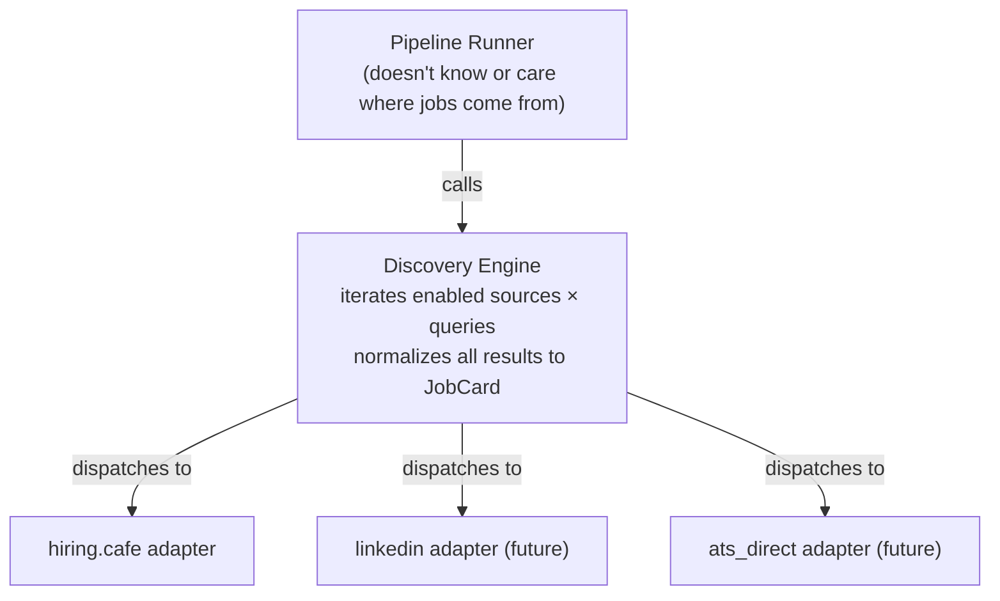

# Source Adapters — Pluggable Job Discovery

**Principle:** Seeker OS is not hardcoded to hiring.cafe. The discovery layer uses a
source adapter interface — hiring.cafe is one adapter. LinkedIn, Indeed, direct ATS
scans, or any other source can be added without touching the pipeline.

---

## Architecture



## Source Adapter Interface

```python
class SourceAdapter(Protocol):
    """Abstract job source adapter. Each source implements this interface."""

    @property
    def id(self) -> str: ...
    @property
    def type(self) -> str: ...         # 'hiring_cafe', 'linkedin', 'ats_direct', etc.

    def fetch_jobs(self, query: SourceQuery, page: int = 0) -> SourcePage:
        """Fetch one page of results for a query.

        Returns SourcePage with:
        - jobs: list[JobCard] (normalized to generic representation)
        - total_count: int (total results for this query)
        - is_last_page: bool
        """

    def test_connection(self) -> bool:
        """Test that the source is reachable and configured correctly."""
```

```python
# All data structures use Pydantic v2 BaseModel

class SourcePage(BaseModel):
    jobs: list[JobCard]            # normalized job cards
    total_count: int               # total results available
    is_last_page: bool             # no more pages
    source: str                    # adapter ID


class SourceQuery(BaseModel):
    """A query to run against a source."""
    source_id: str                 # which adapter to use
    slug: str                      # source-specific query identifier
    label: str                     # human label
    commitment: str                # full_time, contract, both
    max_pages: int                 # max pages to fetch
    enabled: bool
    search_query: str | None       # raw search text (e.g. "senior sre remote")
    posted_within_days: int | None # computed at runtime from last_run_at
    # Server-side filter hints (Phase 2). Populated by the pipeline runner from
    # FilterConfig. Each adapter maps these to its own server-side filter format.
    # Adapters that don't support a given filter simply ignore it. Server-side
    # filters are inclusive of null/missing values (jobs with no data for a field
    # still pass the filter), so these are safe pre-filters — Tier 2 remains the
    # authoritative filter.
    workplace_types: list[str] | None     # e.g. ["Remote"]
    commitments: list[str] | None         # e.g. ["Full Time"]
    seniority_levels: list[str] | None    # e.g. ["Senior Level"]
    role_types: list[str] | None          # e.g. ["Individual Contributor"]
```

## JobCard — Generic Intermediate Representation

`JobCard` is already source-agnostic. All adapters normalize their source-specific
data into this format:

```python
class JobCard(BaseModel):
    # Identity (source-specific, but normalized)
    source_id: str                # which adapter found this (e.g. 'hiring_cafe')
    source_job_id: str            # source-specific job ID
    ats_source: str | None        # canonical ATS (greenhouse, ashby, lever, etc.)
    ats_board_token: str | None
    ats_job_id: str | None
    apply_url: str

    # Job details (normalized)
    title: str
    core_title: str
    company: str
    company_homepage: str | None
    location: str
    workplace_type: str           # Remote, On-Site, Hybrid
    workplace_countries: list[str]
    seniority_level: str | None
    commitment: list[str]
    comp_min: int | None
    comp_max: int | None
    comp_currency: str | None
    technical_tools: list[str]
    requirements_summary: str
    date_posted: str              # ISO timestamp
    role_type: str | None
    is_pinned: bool

    # Metadata
    discovered_query: str         # which query slug found this
```

The hiring.cafe adapter maps `__NEXT_DATA__` fields → `JobCard`. A future LinkedIn
adapter would map LinkedIn's JSON → `JobCard`. The pipeline downstream never sees
source-specific data structures.

## Configuration

### `config/sources.yml` — Source Configuration

```yaml
# 1 to N sources. Each source has a type and source-specific config.
# hiring.cafe is the default enabled source. Others can be added.

sources:
  - id: hiring_cafe
    type: hiring_cafe
    label: "hiring.cafe"
    enabled: true
    base_url: "https://hiring.cafe"
    # Source-specific settings
    request_delay_seconds: 3     # between requests (human-like)
    jd_fetch_delay_seconds: 2    # between JD fetches
    user_agent: "Mozilla/5.0 (X11; Linux x86_64) AppleWebKit/537.36 (KHTML, like Gecko) Chrome/149.0.0.0 Safari/537.36"
    cache_ttl_hours: 6
    max_retries: 3
    timeout_seconds: 15
    # Source map: hiring.cafe source codes → canonical ATS names
    # (used for dedup composite keys and JD fetch routing)
    source_map:
      grnhse: greenhouse
      ashby: ashby
      lever: lever
      workday: workday
      icims2: icims
      bamboohr: bamboohr
      brassring: brassring
      paylocity: paylocity
      rippling: rippling
      adp: adp
      smartrecruiters: smartrecruiters
      taleo_careersection: taleo
      taleo_rss: taleo
      oraclecloud: oraclecloud
      ultipro: ultipro
      jazzhr: jazzhr
      breezy: breezy
      pinpoint: pinpoint
      sparkhire: sparkhire
      eightfold: eightfold
      paycor: paycor
      saashr: saashr
      hrmdirect: hrmdirect
      hiring_cafe_pin: SKIP       # sponsored — always skip

  # --- Future sources (disabled by default) ---
  # - id: linkedin
  #   type: linkedin
  #   label: "LinkedIn"
  #   enabled: false
  #   # LinkedIn-specific config...
  #
  # - id: ats_direct
  #   type: ats_direct
  #   label: "Direct ATS Scans"
  #   enabled: false
  #   # Direct ATS scanning config (Greenhouse/Ashby/Lever board lists)
  #   boards:
  #     - ats: greenhouse
  #       board: trexsolutions
  #     - ats: ashby
  #       board: somecompany
```

### `config/queries.yml` — Updated to Reference Sources

```yaml
# Queries now reference a source_id. This allows different queries
# for different sources. If source_id is omitted, defaults to 'hiring_cafe'.
# search_query (optional): When set, the adapter uses hiring.cafe's structured
# search endpoint (/?searchState=...) with server-side date filtering.
# The pipeline automatically requests only jobs posted since the query's
# last_run_at (incremental search). Use force_full_pull=true on the run
# endpoint to bypass the date filter. When search_query is absent, the
# adapter falls back to the slug-based URL (/jobs/{slug}).
queries:
  - source_id: hiring_cafe
    slug: senior-sre-remote
    label: "Senior SRE Remote"
    commitment: full_time
    max_pages: 1
    enabled: true
    search_query: "senior sre remote"
  - source_id: hiring_cafe
    slug: staff-sre-remote
    label: "Staff SRE Remote"
    commitment: full_time
    max_pages: 1
    enabled: true
    search_query: "staff sre remote"
  # ... (rest of queries)
```

## Adapter Implementations

### hiring.cafe Adapter (`discovery/sources/hiring_cafe.py`)

```python
class HiringCafeAdapter:
    """hiring.cafe source adapter.

    Fetches job cards from hiring.cafe's regular search by extracting
    __NEXT_DATA__ JSON from the HTML response.
    """

    def __init__(self, config: HiringCafeConfig):
        self.base_url = config.base_url
        self.source_map = config.source_map
        self.request_config = RequestConfig(
            delay=config.request_delay_seconds,
            user_agent=config.user_agent,
            cache_ttl=config.cache_ttl_hours,
            max_retries=config.max_retries,
            timeout=config.timeout_seconds,
        )

    def fetch_jobs(self, query: SourceQuery, page: int = 0) -> SourcePage:
        """Fetch one page from hiring.cafe.

        When query.search_query is set, uses the / endpoint with searchState JSON
        (supports server-side date filtering via dateFetchedPastNDays).
        Otherwise falls back to the slug-based /jobs/{slug} URL.

        1. Check disk cache
        2. GET URL (searchState or slug-based)
        3. Extract __NEXT_DATA__ JSON
        4. Parse ssrHits[] → JobCard (using source_map for ATS normalization)
        5. Filter pinned jobs
        6. Cache response
        7. Return SourcePage
        """

    def test_connection(self) -> bool:
        """Verify hiring.cafe is reachable and __NEXT_DATA__ is present."""
```

### Future: LinkedIn Adapter (`discovery/sources/linkedin.py`)

Would map LinkedIn's JSON API response → `JobCard`. Different fetch mechanism,
same output format. The pipeline doesn't change.

### Future: Direct ATS Adapter (`discovery/sources/ats_direct.py`)

Would scan Greenhouse/Ashby/Lever boards directly (the legacy approach).
Maps ATS API responses → `JobCard`. The dedup system's composite key collapse
means jobs found here and on hiring.cafe are automatically deduplicated.

## Project Structure (Updated)

```
backend/seeker_os/
├── discovery/
│   ├── __init__.py
│   ├── engine.py                # Discovery engine: iterates sources × queries
│   ├── cache.py                 # Disk cache (shared across adapters)
│   ├── ats_fetch.py             # Tier 3: JD fetch from ATS APIs/URLs
│   └── sources/
│       ├── __init__.py
│       ├── base.py              # SourceAdapter protocol, SourcePage, SourceQuery
│       ├── hiring_cafe.py       # hiring.cafe adapter
│       └── registry.py          # Adapter registry (type → class mapping)
```

## Why This Is Not a Massive Effort

1. **`JobCard` is already generic** — it was designed as an intermediate representation, not a hiring.cafe-specific struct.
2. **The pipeline doesn't change** — filtering, scoring, dedup, cross-ref all consume `JobCard` and don't know about sources.
3. **The dedup system already handles cross-source** — composite keys collapse hiring.cafe + direct ATS scans automatically.
4. **The work is mostly moving code** — `hiringcafe.py` becomes `sources/hiring_cafe.py` behind an interface.
5. **`sources.yml` is a new config file** — but the source_map that was previously hardcoded is now config-driven (which aligns with the no-hardcode principle).

## What Stays hiring.cafe-Specific

- `__NEXT_DATA__` JSON extraction (in the adapter)
- `source_map` (grnhse → greenhouse) — now in `sources.yml` config, not code
- Pinned job filtering (`is_hc_pinned`) — in the adapter
- URL format (`/jobs/{slug}?page={page}` or `/?searchState={json}`) — in the adapter
- `dateFetchedPastNDays` enum mapping (actual days → hiring.cafe enum values) — in the adapter
- searchState JSON construction (location, sort, date filter, workplace types, commitments, seniority levels, role types) — in the adapter
- Server-side filter field mapping (`workplace_types` → `workplaceTypes`, etc.) — in the adapter

All of this is encapsulated in the adapter. The rest of the system is source-agnostic.
